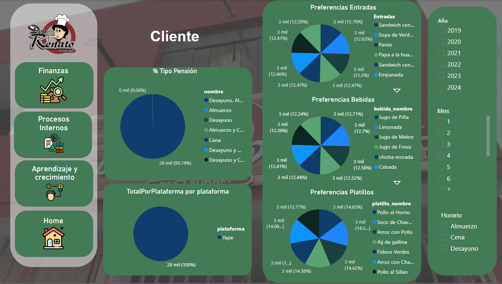

# Don Renato - Dashboard

Este repositorio contiene el archivo Power BI (PBIX) y recursos relacionados con la implementación de un sistema de Business Intelligence para optimizar el análisis de datos de ventas en el restaurante "Don Renato", ubicado en Piura.

## Descripción del Proyecto

El objetivo de este proyecto es proporcionar un sistema de análisis y visualización de datos que facilite la toma de decisiones estratégicas, utilizando herramientas modernas de inteligencia de negocios.

## Tecnologías Utilizadas

- **Power BI:** Para visualización y análisis de datos.
- **MySQL:** Base de datos fuente de los datos del restaurante.
- **ETL:** Procesos de Extracción, Transformación y Carga para la integración de datos.

### Características Principales:

- Análisis de Ventas: Visualización de ingresos, conteo de transacciones y categorías de productos.

- Indicadores Clave de Rendimiento (KPIs): Seguimiento de métricas financieras, satisfacción del cliente y eficiencia operativa.

- Optimización de Procesos: Identificación de patrones y tendencias en la demanda para mejorar la calidad del servicio.

### Tecnologías Utilizadas

- Power BI: Para visualización y análisis de datos.

- MySQL: Base de datos fuente de los datos del restaurante.

- ETL: Procesos de Extracción, Transformación y Carga para la integración de datos.

### Indicadores Clave de Rendimiento (KPIs)

1. Financieros:

- Ingresos mensuales y totales.

- Ranking de meses con mayores ingresos.

2. Satisfacción del Cliente:

- Conteo de tipos de pensión.

- Total por plataforma de pago.

3. Procesos Internos:

- Pedidos por tipo de comida y categoría.

- Variabilidad en la demanda diaria.

4. Crecimiento:

- Total de clientes registrados.

- Nuevos clientes por mes y por empleado.

## Capturas y Diagramas

1. **Base de Datos:**
   - Esquema de la base de datos:
     

2. **Diagrama de Copo de Nieve:**
   - Modelo dimensional utilizado en Power BI:
     

3. **Dashboards:**

    
   
   - **Financiera:** Indicadores relacionados con ingresos y rentabilidad.
     

   - **Procesos Internos:** Análisis de eficiencia operativa.
     

   - **Aprendizaje y Crecimiento:** Datos sobre clientes registrados y estrategias de desarrollo.
     

   - **Clientes:** Indicadores de satisfacción y preferencias de los clientes.
     

